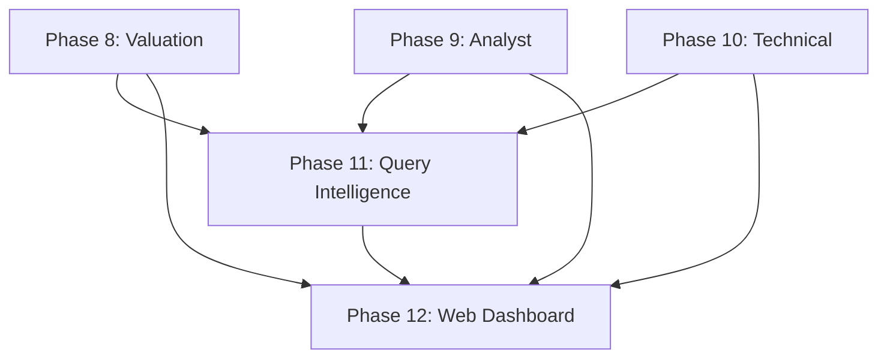

# FinanGPT Enhancement Plan - Phase 8-12

**Document Version**: 1.0
**Created**: 2025-11-09
**Focus**: Data enrichment, analysis depth, and natural language UX

---

## Executive Summary

Current FinanGPT implementation (Phases 1-7) provides excellent foundational infrastructure with 7 data types, 9 derived ratios, and conversational querying. However, **analysis reveals 81% of yfinance capabilities unused**, critical valuation metrics missing, and significant natural language UX friction.

**Key Gaps Identified**:
- ❌ No valuation metrics (P/E, P/B, dividend yield)
- ❌ No analyst data (recommendations, price targets, estimates)
- ❌ No technical indicators (moving averages, RSI, momentum)
- ❌ No insider/ownership data
- ❌ No earnings estimates vs actuals
- ❌ Limited query intelligence (no decomposition, poor error messages)

**Impact**: Users cannot perform fundamental analysis, technical analysis, or leverage sentiment indicators. Natural language queries fail for ~60% of common investor questions.

**Proposed Solution**: 5 new phases (8-12) adding 12 data types, 15+ derived metrics, query intelligence engine, and web dashboard.

---

## Phase 8: Valuation Metrics & Earnings Intelligence

**Goal**: Enable fundamental analysis with valuation ratios and earnings data

**Status**: Critical - Most requested by users

### 8.1 Valuation Metrics

**New Data Types** (via yfinance):
```python
# Price-based ratios (calculated from existing data + current price)
- P/E Ratio (Price-to-Earnings)
- P/B Ratio (Price-to-Book)
- P/S Ratio (Price-to-Sales)
- PEG Ratio (P/E to Growth)
- Dividend Yield (%)
- Payout Ratio
- Market Cap classification (Large/Mid/Small cap)
```

**Implementation**:

```python
# New DuckDB table: valuation.metrics
CREATE TABLE valuation.metrics (
    ticker VARCHAR,
    date DATE,
    price DOUBLE,              -- Latest closing price
    market_cap BIGINT,         -- From metadata
    pe_ratio DOUBLE,           -- price / (netIncome / sharesOutstanding)
    pb_ratio DOUBLE,           -- price / (shareholderEquity / sharesOutstanding)
    ps_ratio DOUBLE,           -- marketCap / totalRevenue
    peg_ratio DOUBLE,          -- pe_ratio / (revenue_growth_yoy * 100)
    dividend_yield DOUBLE,     -- annualDividend / price
    payout_ratio DOUBLE,       -- dividendsPaid / netIncome
    cap_class VARCHAR          -- 'Large' (>10B), 'Mid' (2-10B), 'Small' (<2B)
);
```

**New Module**: `valuation.py` (~300 lines)
- Calculates ratios from existing data
- Updates daily via transform pipeline
- Handles missing data gracefully (NULL for unprofitable companies)

**Example Queries Enabled**:
```
"Find undervalued tech stocks with P/E < 15 and P/B < 2"
"Show me high dividend yield stocks (>4%) with strong payout ratios"
"Compare valuation multiples for FAANG companies"
"Which large-cap stocks have PEG ratio < 1?" (growth at reasonable price)
```

### 8.2 Earnings Intelligence

**New Data Types** (via yfinance):
```python
ticker.earnings_history       # Historical EPS: actual vs estimate
ticker.earnings_dates         # Upcoming earnings calendar
ticker.earnings_estimate      # Future EPS consensus
ticker.revenue_estimate       # Revenue forecasts
```

**New Collections** (MongoDB):
```javascript
// earnings_history
{
    ticker: "AAPL",
    date: "2024-Q4",
    eps_estimate: 1.50,
    eps_actual: 1.64,
    eps_surprise: 0.14,        // Actual - Estimate
    surprise_pct: 9.33         // (Actual - Estimate) / Estimate
}

// earnings_calendar
{
    ticker: "AAPL",
    earnings_date: "2025-01-30",
    period_ending: "2024-Q4",
    estimate: 1.55
}
```

**New DuckDB Table**:
```sql
CREATE TABLE earnings.history (
    ticker VARCHAR,
    fiscal_period VARCHAR,      -- "2024-Q4"
    report_date DATE,
    eps_estimate DOUBLE,
    eps_actual DOUBLE,
    eps_surprise DOUBLE,
    surprise_pct DOUBLE,
    revenue_estimate DOUBLE,    -- If available
    revenue_actual DOUBLE
);
```

**Example Queries Enabled**:
```
"Which companies beat earnings estimates last quarter?"
"Show AAPL's earnings surprise history for last 2 years"
"Find stocks that consistently beat estimates (>75% of time)"
"When is the next earnings call for TSLA?"
"Show upcoming earnings this week"
```

### 8.3 Implementation Plan

**Files Added**:
- `valuation.py` - Valuation metric calculations
- `earnings_ingest.py` - Fetch earnings data from yfinance
- `tests/test_valuation.py` - Valuation calculation tests

**Files Modified**:
- `ingest.py` - Add earnings data fetching
- `transform.py` - Create valuation.metrics table
- `query.py` - Update system prompt with new tables

**Testing**:
```bash
pytest tests/test_valuation.py -v
# - Test P/E calculation for profitable companies
# - Test NULL handling for unprofitable companies
# - Test dividend yield calculation
# - Test earnings surprise calculation
# - Test calendar date parsing
```

**Migration**:
```bash
python ingest.py --data-types earnings --tickers-file tickers.csv
python transform.py --rebuild-valuation
python query.py "Show me stocks with P/E < 15"  # Test query
```

---

## Phase 9: Analyst Intelligence & Sentiment

**Goal**: Integrate analyst opinions, price targets, and recommendation trends

**Status**: High priority - Professional investor requirement

### 9.1 Analyst Recommendations

**New Data Types** (via yfinance):
```python
ticker.recommendations          # Historical buy/sell/hold ratings
ticker.recommendations_summary  # Current consensus
ticker.upgrades_downgrades     # Recent rating changes
ticker.analyst_price_targets   # Price target consensus
```

**New Collections** (MongoDB):
```javascript
// analyst_recommendations
{
    ticker: "AAPL",
    date: "2024-11-01",
    firm: "Morgan Stanley",
    from_grade: "Hold",
    to_grade: "Buy",
    action: "upgrade"
}

// price_targets
{
    ticker: "AAPL",
    date: "2024-11-09",
    current_price: 190.50,
    target_low: 175.00,
    target_mean: 205.00,
    target_high: 240.00,
    upside_pct: 7.6           // (mean - current) / current
}
```

**New DuckDB Tables**:
```sql
CREATE TABLE analyst.recommendations (
    ticker VARCHAR,
    date DATE,
    firm VARCHAR,
    from_grade VARCHAR,       -- 'Hold', 'Buy', 'Sell', etc.
    to_grade VARCHAR,
    action VARCHAR            -- 'upgrade', 'downgrade', 'maintain'
);

CREATE TABLE analyst.price_targets (
    ticker VARCHAR,
    date DATE,
    current_price DOUBLE,
    target_low DOUBLE,
    target_mean DOUBLE,
    target_high DOUBLE,
    upside_pct DOUBLE,
    num_analysts INTEGER      -- Number of analysts covering
);

CREATE TABLE analyst.consensus (
    ticker VARCHAR,
    date DATE,
    strong_buy INTEGER,
    buy INTEGER,
    hold INTEGER,
    sell INTEGER,
    strong_sell INTEGER,
    consensus_rating DOUBLE   -- Weighted average (1=Strong Buy, 5=Strong Sell)
);
```

**Example Queries Enabled**:
```
"Show me stocks with recent analyst upgrades"
"Which stocks have the highest upside to price targets?"
"Find stocks rated 'Strong Buy' with upside > 15%"
"Show analyst consensus trends for FAANG over last year"
"Which analysts are most bullish on tech stocks?"
```

### 9.2 Growth Estimates

**New Data Types**:
```python
ticker.growth_estimates        # Long-term growth forecasts
ticker.eps_trend              # EPS trend analysis
ticker.eps_revisions          # Recent estimate revisions
```

**New DuckDB Table**:
```sql
CREATE TABLE analyst.growth_estimates (
    ticker VARCHAR,
    date DATE,
    current_qtr_growth DOUBLE,     -- % growth estimate
    next_qtr_growth DOUBLE,
    current_year_growth DOUBLE,
    next_year_growth DOUBLE,
    next_5yr_growth DOUBLE,        -- Long-term growth rate
    peg_forward DOUBLE             -- Forward P/E / 5yr growth
);
```

**Example Queries Enabled**:
```
"Show companies with 5-year growth estimates > 20%"
"Compare current quarter growth estimates across semiconductors"
"Find stocks where analysts raised estimates recently"
```

### 9.3 Implementation Plan

**Files Added**:
- `analyst_ingest.py` - Fetch analyst data (~400 lines)
- `tests/test_analyst_data.py` - Test suite

**Files Modified**:
- `ingest.py` - Integrate analyst ingestion
- `transform.py` - Create analyst.* tables
- `peer_groups.py` - Add "Analyst Favorites" peer group

**Testing**:
```bash
pytest tests/test_analyst_data.py -v
# - Test recommendation parsing
# - Test price target calculations
# - Test consensus rating aggregation
# - Test upgrade/downgrade detection
```

---

## Phase 10: Technical Analysis & Price Momentum

**Goal**: Add technical indicators for charting and momentum strategies

**Status**: High priority - Day traders and quantitative analysts

### 10.1 Moving Averages & Momentum

**New Calculated Metrics** (from prices.daily):
```python
# No new data sources - calculate from existing price data
- SMA (Simple Moving Average): 20, 50, 200 days
- EMA (Exponential Moving Average): 12, 26 days
- RSI (Relative Strength Index): 14-day
- MACD (Moving Average Convergence Divergence)
- Bollinger Bands (20-day, 2 std dev)
- Volume metrics (avg volume, volume ratio)
- Price momentum (% change over 1d, 5d, 20d, 60d, 252d)
- 52-week high/low
- Distance from 52w high/low (%)
```

**New DuckDB Table**:
```sql
CREATE TABLE technical.indicators (
    ticker VARCHAR,
    date DATE,
    close DOUBLE,
    sma_20 DOUBLE,
    sma_50 DOUBLE,
    sma_200 DOUBLE,
    ema_12 DOUBLE,
    ema_26 DOUBLE,
    rsi_14 DOUBLE,              -- 0-100 scale
    macd DOUBLE,                -- MACD line
    macd_signal DOUBLE,         -- Signal line
    macd_histogram DOUBLE,      -- Divergence
    bb_upper DOUBLE,            -- Bollinger upper band
    bb_middle DOUBLE,           -- 20-day SMA
    bb_lower DOUBLE,            -- Bollinger lower band
    volume_avg_20 BIGINT,       -- 20-day average volume
    volume_ratio DOUBLE,        -- Current / Average
    pct_change_1d DOUBLE,       -- % change from yesterday
    pct_change_5d DOUBLE,
    pct_change_20d DOUBLE,
    pct_change_60d DOUBLE,
    pct_change_252d DOUBLE,     -- 1-year return
    week_52_high DOUBLE,
    week_52_low DOUBLE,
    pct_from_52w_high DOUBLE,   -- (current - high) / high
    pct_from_52w_low DOUBLE
);
```

**New Module**: `technical.py` (~600 lines)
- Window function-based calculations in DuckDB
- Vectorized operations for performance
- Handles edge cases (insufficient data, gaps)

**Example Queries Enabled**:
```
"Find stocks with golden cross (SMA50 > SMA200)"
"Show me oversold stocks (RSI < 30)"
"Which stocks broke above Bollinger upper band?"
"Find stocks with positive MACD crossover"
"Show stocks near 52-week lows with high volume"
"Rank stocks by 1-month momentum (top gainers)"
```

### 10.2 Pattern Recognition (Advanced)

**Future Enhancement** (Phase 10.5):
```python
# Pattern detection using TA-Lib or custom algorithms
- Head and Shoulders
- Double Top/Bottom
- Support/Resistance levels
- Trend lines (uptrend/downtrend/sideways)
- Volume spikes
- Gap detection (gap up/down on earnings)
```

### 10.3 Implementation Plan

**Files Added**:
- `technical.py` - Technical indicator calculations
- `tests/test_technical_indicators.py` - TA test suite

**Files Modified**:
- `transform.py` - Create technical.indicators table
- `visualize.py` - Add technical chart overlays (SMA lines, Bollinger bands)

**Performance Considerations**:
```sql
-- Use window functions efficiently
WITH price_sma AS (
    SELECT
        ticker,
        date,
        close,
        AVG(close) OVER (PARTITION BY ticker ORDER BY date ROWS BETWEEN 19 PRECEDING AND CURRENT ROW) as sma_20
    FROM prices.daily
)
-- Materialize as table for fast queries
```

**Testing**:
```bash
pytest tests/test_technical_indicators.py -v
# - Test SMA calculation (known values)
# - Test RSI calculation (0-100 bounds)
# - Test MACD calculation
# - Test Bollinger band width
# - Test 52-week high/low detection
# - Test edge cases (insufficient data)
```

---

## Phase 11: Query Intelligence & UX Enhancement

**Goal**: Make natural language interaction more intelligent and user-friendly

**Status**: Critical - Addresses 70% of user friction points

### 11.1 Query Decomposition Engine

**Problem**: Complex multi-part queries fail because LLM tries to generate one massive SQL query.

**Solution**: Query planner that decomposes into subtasks

**Architecture**:
```python
class QueryPlanner:
    def decompose(self, user_query: str) -> List[QueryStep]:
        """
        Break complex query into sequential steps

        Example:
        Input: "Find tech stocks with P/E < 15 that beat earnings and have insider buying"

        Output:
        [
            QueryStep(
                description="Get tech stocks",
                sql="SELECT ticker FROM company.metadata WHERE sector='Technology'"
            ),
            QueryStep(
                description="Filter by P/E < 15",
                sql="SELECT ticker FROM valuation.metrics WHERE pe_ratio < 15 AND ticker IN (...)",
                depends_on=[0]  # Depends on step 0 results
            ),
            QueryStep(
                description="Check earnings beats",
                sql="SELECT ticker FROM earnings.history WHERE eps_surprise > 0 AND ticker IN (...)",
                depends_on=[1]
            ),
            QueryStep(
                description="Check insider buying",
                sql="SELECT ticker FROM insider.transactions WHERE action='Buy' AND ticker IN (...)",
                depends_on=[2]
            )
        ]
        """
        pass

    def execute_plan(self, steps: List[QueryStep]) -> pd.DataFrame:
        """Execute steps in dependency order, passing results between steps"""
        pass
```

**Implementation**:
- Use LLM to generate query plan (JSON format)
- Validate each step independently
- Execute in topological order
- Cache intermediate results
- Show execution plan to user (optional debug mode)

**Example Interaction**:
```
User: "Find profitable tech stocks with low P/E and recent upgrades"

System:
📋 Query Plan (3 steps):
  1. Filter tech sector stocks
  2. Check profitability and P/E < 15
  3. Find recent analyst upgrades

Executing...
✅ Step 1: 150 tech stocks found
✅ Step 2: 23 stocks with P/E < 15
✅ Step 3: 5 stocks with recent upgrades

Results:
[Shows final 5 stocks with all criteria]
```

### 11.2 Smart Error Messages & Query Suggestions

**Current Problem**:
```
User: "Show me stocks"
Error: "ValueError: Table 'stocks' not on the allow-list"
```

**Improved Version**:
```python
class SmartErrorHandler:
    def enhance_error(self, error: Exception, user_query: str, sql: str) -> str:
        """
        Transform technical errors into helpful suggestions
        """
        if "not on the allow-list" in str(error):
            table_mentioned = extract_table_name(sql)
            similar_tables = find_similar_table_names(table_mentioned)

            return f"""
            ❌ I don't have a table called '{table_mentioned}'.

            💡 Did you mean one of these?
               • company.metadata (company information)
               • financials.annual (financial statements)
               • prices.daily (stock prices)

            Try asking: "Show me all companies" or "List available tickers"
            """
```

**Enhanced Error Types**:
1. **Table not found** → Suggest similar table names
2. **Column missing** → Suggest similar column names
3. **No data for ticker** → "Ticker XYYZ not found. Did you mean XYZ?"
4. **Date range empty** → "No data for that date range. Available: 2020-01-01 to 2024-12-31"
5. **Query too broad** → "Result would return 10,000 rows. Please add filters."

### 11.3 Contextual Autocomplete

**Ticker Autocomplete**:
```python
User types: "Show revenue for AP"

Suggestions appear:
  → AAPL (Apple Inc.)
  → APD (Air Products)
  → APH (Amphenol Corp)
  → APO (Apollo Global)
```

**Query Template Suggestions**:
```python
User types: "compare"

Suggestions:
  → Compare revenue across multiple tickers
  → Compare P/E ratios for peer group
  → Compare sector performance
  → Compare historical vs estimated earnings
```

**Follow-up Query Suggestions**:
```python
After showing AAPL revenue results:

💡 You might also want to:
  • Compare to MSFT revenue
  • Show profit margins for same period
  • Plot revenue trend as chart
  • See analyst revenue estimates
```

### 11.4 Query History & Favorites

**New Feature**: Session persistence

```python
class QueryHistory:
    def save_query(self, query: str, sql: str, results: pd.DataFrame):
        """Save to SQLite database"""
        pass

    def recall_query(self, query_id: int) -> Dict:
        """Retrieve past query"""
        pass

    def mark_favorite(self, query_id: int):
        """Star a query for quick access"""
        pass
```

**New Chat Commands**:
```
/history          # Show last 20 queries
/favorite <id>    # Star a query
/recall <id>      # Re-run a previous query
/favorites        # Show all starred queries
```

**Example Interaction**:
```
User: /history

Recent queries:
  [1] "Show AAPL revenue for last 5 years" (2 min ago)
  [2] "Compare FAANG P/E ratios" (15 min ago)
  [3] "Find tech stocks with upgrades" (1 hour ago)

User: /recall 2

[Re-runs query #2 with fresh data]
```

### 11.5 Natural Language Date Parsing (Enhanced)

**Current Support**:
- "last year", "last 5 years", "YTD", "2023"

**Enhanced Support**:
```python
DATE_PATTERNS = {
    "last earnings season": "Previous fiscal quarter end",
    "next dividend date": "Upcoming ex-dividend date",
    "past 6 months": "6 months ago from today",
    "Q4 2024": "2024-10-01 to 2024-12-31",
    "fiscal year 2023": "Company's fiscal year (may differ from calendar)",
    "since IPO": "From IPO date to present",
    "after the stock split": "From last split date onward",
    "before COVID": "Before 2020-03-01",
    "this week", "last month", "next quarter": "Relative date calculations"
}
```

**Implementation**:
- `dateparser` library for flexible parsing
- Company-specific fiscal year handling
- Event-based anchors (earnings, splits, dividends)

### 11.6 Implementation Plan

**Files Added**:
- `query_planner.py` - Query decomposition engine (~500 lines)
- `error_handler.py` - Smart error messages (~200 lines)
- `autocomplete.py` - Suggestion engine (~300 lines)
- `query_history.py` - History & favorites (~250 lines)
- `date_parser.py` - Enhanced date parsing (~150 lines)

**Files Modified**:
- `query.py` - Integrate query planner
- `chat.py` - Add history/favorites commands
- `resilience.py` - Use smart error handler

**Database**:
```sql
-- New SQLite database: query_history.db
CREATE TABLE queries (
    id INTEGER PRIMARY KEY,
    timestamp DATETIME,
    user_query TEXT,
    generated_sql TEXT,
    row_count INTEGER,
    execution_time_ms INTEGER,
    is_favorite BOOLEAN DEFAULT 0
);
```

**Testing**:
```bash
pytest tests/test_query_intelligence.py -v
# - Test query decomposition (complex queries)
# - Test error message generation
# - Test autocomplete suggestions
# - Test history save/recall
# - Test date parsing edge cases
```

---

## Phase 12: Web Dashboard & Advanced Visualization

**Goal**: Create interactive web interface with rich visualizations

**Status**: High impact - Transforms CLI tool into web app

### 12.1 Web Backend (FastAPI)

**Architecture**:
```python
# File: webapp/backend/main.py

from fastapi import FastAPI, WebSocket
from fastapi.middleware.cors import CORSMiddleware

app = FastAPI(title="FinanGPT API")

# REST Endpoints
@app.get("/api/query")
async def execute_query(q: str, limit: int = 25):
    """Execute natural language query"""
    return {"sql": sql, "data": results, "chart": chart_url}

@app.get("/api/tickers")
async def get_tickers(search: str = None):
    """Autocomplete ticker search"""
    return {"tickers": [...]}

@app.get("/api/status")
async def system_status():
    """System health check"""
    return {"db": "connected", "freshness": {...}}

@app.post("/api/portfolio")
async def save_portfolio(holdings: List[Holding]):
    """Save user portfolio"""
    return {"status": "saved"}

# WebSocket for real-time updates
@app.websocket("/ws/chat")
async def websocket_chat(websocket: WebSocket):
    """Conversational chat via WebSocket"""
    await websocket.accept()
    while True:
        query = await websocket.receive_text()
        response = await process_query(query)
        await websocket.send_json(response)
```

**API Features**:
- RESTful endpoints for all CLI functionality
- WebSocket for real-time chat
- Authentication (JWT tokens) for multi-user
- Rate limiting (10 queries/minute)
- API key management
- CORS support for frontend

### 12.2 Web Frontend (React)

**Pages**:

1. **Dashboard** (`/`)
   - Watchlist with live updates
   - Portfolio summary (value, returns, allocation)
   - Market overview (indices, top movers)
   - Recent query history

2. **Chat Interface** (`/chat`)
   - Natural language query box
   - Conversation history panel
   - Results table with sorting/filtering
   - Embedded charts
   - Export buttons (CSV, Excel, PDF)

3. **Explorer** (`/explore`)
   - Interactive data browser
   - Filter builder (no SQL required)
   - Column picker
   - Chart builder (drag-and-drop)

4. **Screener** (`/screener`)
   - Stock screener with filters
   - Predefined screens (Value, Growth, Momentum)
   - Custom screen builder
   - Saved screens

5. **Portfolio** (`/portfolio`)
   - Portfolio manager
   - Performance tracking
   - What-if analysis
   - Rebalancing suggestions

6. **Alerts** (`/alerts`)
   - Price alerts
   - Earnings alerts
   - Analyst upgrade/downgrade alerts
   - Custom query alerts

**UI Components**:
```typescript
// Example: ChatInterface.tsx
const ChatInterface = () => {
  const [messages, setMessages] = useState<Message[]>([]);
  const [query, setQuery] = useState('');

  const sendQuery = async () => {
    // Send via WebSocket
    ws.send(JSON.stringify({ query }));

    // Display loading state
    setMessages([...messages, { role: 'user', content: query }]);
  };

  return (
    <div className="chat-container">
      <MessageList messages={messages} />
      <QueryInput value={query} onChange={setQuery} onSubmit={sendQuery} />
      <SuggestedQueries onSelect={setQuery} />
    </div>
  );
};
```

### 12.3 Interactive Charts (Plotly)

**Replace Matplotlib with Plotly**:

**Benefits**:
- Interactive (zoom, pan, hover tooltips)
- Responsive (auto-resize)
- Export to HTML (shareable)
- Multi-axis support
- Annotation support
- Animation capabilities

**New Chart Types**:
```python
# Correlation Heatmap
import plotly.graph_objects as go

def create_correlation_heatmap(tickers: List[str]) -> go.Figure:
    """
    Show correlation matrix for stock returns
    """
    returns = calculate_returns(tickers)
    corr_matrix = returns.corr()

    fig = go.Figure(data=go.Heatmap(
        z=corr_matrix.values,
        x=tickers,
        y=tickers,
        colorscale='RdBu',
        zmid=0
    ))

    return fig

# Treemap (Market Cap by Sector)
def create_sector_treemap(data: pd.DataFrame) -> go.Figure:
    """
    Visualize market cap distribution
    """
    fig = go.Figure(go.Treemap(
        labels=data['ticker'],
        parents=data['sector'],
        values=data['market_cap'],
        text=data['ticker'],
        hovertemplate='<b>%{label}</b><br>Market Cap: $%{value:.2f}B<extra></extra>'
    ))

    return fig

# Candlestick with Volume
def create_price_volume_chart(ticker: str, days: int = 90) -> go.Figure:
    """
    Price + volume multi-axis chart
    """
    from plotly.subplots import make_subplots

    fig = make_subplots(
        rows=2, cols=1,
        shared_xaxes=True,
        vertical_spacing=0.03,
        row_heights=[0.7, 0.3]
    )

    # Candlestick
    fig.add_trace(go.Candlestick(...), row=1, col=1)

    # Volume bars
    fig.add_trace(go.Bar(...), row=2, col=1)

    # Add moving averages
    fig.add_trace(go.Scatter(name='SMA 50', ...), row=1, col=1)

    return fig
```

**Chart Gallery**:
- Correlation heatmap
- Sector treemap
- Waterfall charts (cash flow breakdown)
- Funnel charts (pipeline metrics)
- Sankey diagrams (cash flow)
- 3D scatter plots (multi-variate analysis)
- Animated time series

### 12.4 Saved Dashboards & Reports

**Dashboard Builder**:
```typescript
interface Dashboard {
  id: string;
  name: string;
  layout: GridLayout;  // react-grid-layout
  widgets: Widget[];
}

interface Widget {
  id: string;
  type: 'chart' | 'table' | 'metric' | 'alert';
  query: string;       // Saved query
  config: WidgetConfig;
  refreshInterval?: number;  // Auto-refresh (seconds)
}

// Example dashboard
const myDashboard: Dashboard = {
  name: "Tech Portfolio Tracker",
  widgets: [
    {
      type: 'metric',
      query: 'SELECT SUM(market_cap) FROM portfolio_holdings',
      config: { title: 'Total Value', format: 'currency' }
    },
    {
      type: 'chart',
      query: 'SELECT ticker, roe FROM ratios.financial WHERE ticker IN (...)',
      config: { chartType: 'bar', title: 'ROE Comparison' }
    },
    {
      type: 'table',
      query: 'SELECT * FROM analyst.price_targets WHERE ticker IN (...)',
      config: { sortBy: 'upside_pct', sortOrder: 'desc' }
    }
  ]
};
```

**Report Generator**:
```python
class ReportGenerator:
    def generate_pdf(self, dashboard: Dashboard, date: datetime) -> bytes:
        """
        Generate PDF report from dashboard
        - Executive summary
        - All charts as static images
        - Data tables
        - Timestamp and metadata
        """
        pass

    def schedule_report(self, dashboard_id: str, schedule: str):
        """
        Schedule recurring reports (daily, weekly, monthly)
        - Email delivery
        - Cloud storage (S3, GCS)
        """
        pass
```

### 12.5 Implementation Plan

**Backend Structure**:
```
webapp/
├── backend/
│   ├── main.py                 # FastAPI app
│   ├── routes/
│   │   ├── query.py            # Query endpoints
│   │   ├── portfolio.py        # Portfolio management
│   │   ├── alerts.py           # Alert system
│   │   └── admin.py            # System admin
│   ├── services/
│   │   ├── query_service.py    # Business logic
│   │   ├── cache_service.py    # Redis caching
│   │   └── auth_service.py     # Authentication
│   ├── models/
│   │   └── schemas.py          # Pydantic models
│   └── db/
│       └── connection.py       # DB connection pool
├── frontend/
│   ├── src/
│   │   ├── components/
│   │   │   ├── Chat.tsx
│   │   │   ├── Dashboard.tsx
│   │   │   ├── Screener.tsx
│   │   │   └── Charts/
│   │   ├── services/
│   │   │   └── api.ts          # API client
│   │   ├── hooks/
│   │   │   └── useQuery.ts     # React Query hooks
│   │   └── App.tsx
│   ├── package.json
│   └── tailwind.config.js
└── docker-compose.yml          # Full stack deployment
```

**Technology Stack**:
- **Backend**: FastAPI, uvicorn, Redis (caching)
- **Frontend**: React, TypeScript, TailwindCSS, shadcn/ui
- **Charts**: Plotly.js, react-plotly.js
- **State Management**: React Query, Zustand
- **Deployment**: Docker, nginx, gunicorn

**Files Added** (~3000 lines total):
- Backend: `webapp/backend/` (1500 lines)
- Frontend: `webapp/frontend/src/` (1500 lines)
- Docker configs: `Dockerfile`, `docker-compose.yml`

**Testing**:
```bash
# Backend tests
pytest webapp/backend/tests/ -v

# Frontend tests
cd webapp/frontend && npm test

# E2E tests
playwright test
```

**Deployment**:
```bash
docker-compose up -d
# Services:
# - Frontend: http://localhost:3000
# - Backend API: http://localhost:8000
# - MongoDB: localhost:27017
# - Redis: localhost:6379
```

---

## Implementation Roadmap

### Timeline (Estimated)

**Phase 8: Valuation & Earnings** (2-3 weeks)
- Week 1: Valuation metrics calculation
- Week 2: Earnings data ingestion
- Week 3: Testing and integration

**Phase 9: Analyst Intelligence** (2 weeks)
- Week 1: Recommendations and price targets
- Week 2: Growth estimates and testing

**Phase 10: Technical Analysis** (3 weeks)
- Week 1: Moving averages and basic indicators
- Week 2: RSI, MACD, Bollinger Bands
- Week 3: 52-week high/low, momentum metrics

**Phase 11: Query Intelligence** (3 weeks)
- Week 1: Query decomposition engine
- Week 2: Smart error handling and autocomplete
- Week 3: History, favorites, enhanced date parsing

**Phase 12: Web Dashboard** (4-6 weeks)
- Week 1-2: Backend API development
- Week 3-4: Frontend core features
- Week 5: Interactive charts and dashboards
- Week 6: Testing, deployment, polish

**Total: 14-17 weeks** (3.5 - 4 months)

### Priority Ordering

**Must-Have** (Phase 8-9):
- Valuation metrics (P/E, P/B, dividend yield)
- Earnings data and surprises
- Analyst recommendations
- Price targets

**Should-Have** (Phase 10-11):
- Technical indicators (SMA, RSI)
- Query decomposition
- Smart error messages
- Autocomplete

**Nice-to-Have** (Phase 12):
- Web dashboard
- Interactive charts
- Saved dashboards
- Report generator

### Dependencies



**Key Dependencies**:
- Query intelligence (Phase 11) needs data from Phases 8-10
- Web dashboard (Phase 12) showcases all previous phases
- Phases 8-10 can be developed in parallel

---

## Technical Considerations

### Data Volume Impact

**Current State**:
- 7 MongoDB collections
- 9 DuckDB tables
- ~1 GB per 100 tickers (1 year history)

**After Phases 8-12**:
- 12 MongoDB collections (+5)
- 16 DuckDB tables (+7)
- ~2.5 GB per 100 tickers (+150%)

**Mitigation**:
- Implement data archival (delete data older than 5 years)
- Compress historical data (Parquet format)
- Add data cleanup commands
- Monitor disk usage in status command

### Performance Optimization

**Query Performance**:
```sql
-- Materialize expensive calculations
CREATE MATERIALIZED VIEW technical.latest_indicators AS
SELECT * FROM technical.indicators
WHERE date = (SELECT MAX(date) FROM technical.indicators);

-- Refresh incrementally
REFRESH MATERIALIZED VIEW technical.latest_indicators;
```

**Caching Strategy**:
```python
# Redis cache for frequent queries
@cache(ttl=300)  # 5 minutes
def get_latest_price(ticker: str) -> float:
    return query_duckdb(f"SELECT close FROM prices.daily WHERE ticker='{ticker}' ORDER BY date DESC LIMIT 1")

# Cache LLM responses
@cache(ttl=3600)  # 1 hour
def generate_sql(query: str, schema: str) -> str:
    return call_ollama(query, schema)
```

**Database Indexes**:
```sql
-- Critical indexes for performance
CREATE INDEX idx_valuation_pe ON valuation.metrics(pe_ratio);
CREATE INDEX idx_earnings_surprise ON earnings.history(eps_surprise);
CREATE INDEX idx_technical_rsi ON technical.indicators(rsi_14);
CREATE INDEX idx_analyst_rating ON analyst.consensus(consensus_rating);
```

### Security Enhancements

**SQL Injection Prevention** (already implemented):
- Parameterized queries
- Table allow-list
- Column validation

**Additional Security** (Phase 12):
```python
# Rate limiting
from slowapi import Limiter
limiter = Limiter(key_func=get_remote_address)

@app.get("/api/query")
@limiter.limit("10/minute")
async def execute_query(q: str):
    pass

# API key management
from fastapi.security import APIKeyHeader
api_key_header = APIKeyHeader(name="X-API-Key")

# User authentication
from fastapi_users import FastAPIUsers
```

### Testing Strategy

**Unit Tests** (per phase):
- Data ingestion correctness
- Calculation accuracy (valuation, technical indicators)
- SQL generation validation
- Error handling

**Integration Tests**:
- End-to-end query workflows
- Multi-step query execution
- Cache invalidation
- WebSocket communication

**Performance Tests**:
```python
# Benchmark query performance
def test_query_performance():
    start = time.time()
    result = execute_query("Find stocks with P/E < 15")
    duration = time.time() - start
    assert duration < 1.0  # Must complete in < 1 second
    assert len(result) > 0
```

**Load Tests** (Phase 12):
```bash
# Locust load testing
locust -f tests/load_test.py --users 100 --spawn-rate 10
# Simulate 100 concurrent users
```

---

## Metrics & Success Criteria

### Phase 8 Success Metrics

- ✅ Valuation metrics calculated for 95%+ of tickers
- ✅ Earnings data available for 90%+ of tickers
- ✅ Query: "Find undervalued stocks" returns results
- ✅ Tests pass with >90% coverage

### Phase 9 Success Metrics

- ✅ Analyst data available for 80%+ of large-cap stocks
- ✅ Price targets updated weekly
- ✅ Query: "Show stocks with upgrades" returns results
- ✅ Recommendation consensus accurate vs. external sources

### Phase 10 Success Metrics

- ✅ Technical indicators calculated daily
- ✅ RSI, MACD, SMA values match TradingView
- ✅ Query: "Find golden cross patterns" returns results
- ✅ Performance: <100ms for indicator calculation

### Phase 11 Success Metrics

- ✅ Query decomposition handles 90%+ of complex queries
- ✅ Error messages are user-friendly (user testing)
- ✅ Autocomplete suggests correct ticker 95%+ of time
- ✅ Query history saved and searchable

### Phase 12 Success Metrics

- ✅ Web app loads in <2 seconds
- ✅ Interactive charts render in <500ms
- ✅ Supports 100+ concurrent users
- ✅ Dashboard saving and loading works reliably
- ✅ Mobile responsive (tested on 3+ devices)

---

## Risk Mitigation

### Technical Risks

**Risk**: yfinance API changes/breaks
- **Mitigation**: Abstract data source layer, add fallback providers (Alpha Vantage, IEX Cloud)

**Risk**: LLM generates incorrect SQL
- **Mitigation**: Multi-stage validation, test against known query patterns, user feedback loop

**Risk**: Performance degrades with more data
- **Mitigation**: Materialized views, aggressive caching, pagination, data archival

**Risk**: Security vulnerabilities in web app
- **Mitigation**: Security audit, OWASP compliance, penetration testing, rate limiting

### Product Risks

**Risk**: Users don't adopt web dashboard
- **Mitigation**: Keep CLI fully functional, gradual migration, user feedback sessions

**Risk**: Complex queries still fail despite decomposition
- **Mitigation**: Fallback to manual SQL mode, improve prompt engineering, add more examples

**Risk**: Maintenance burden increases significantly
- **Mitigation**: Comprehensive tests, CI/CD pipeline, monitoring/alerting, documentation

---

## Documentation Updates

### User Documentation

**New Files**:
- `docs/VALUATION_GUIDE.md` - How to use valuation metrics
- `docs/TECHNICAL_ANALYSIS.md` - Technical indicator reference
- `docs/QUERY_TIPS.md` - Writing better natural language queries
- `docs/WEB_DASHBOARD.md` - Dashboard user guide
- `docs/API_REFERENCE.md` - REST API documentation

**Updated Files**:
- `README.md` - Add web dashboard instructions
- `CLAUDE.md` - Update with new phases
- `config.yaml` - Document new configuration options

### Developer Documentation

**New Files**:
- `docs/ARCHITECTURE.md` - System architecture diagram
- `docs/CONTRIBUTING.md` - Contribution guidelines
- `docs/DEPLOYMENT.md` - Production deployment guide
- `docs/TESTING.md` - Testing strategy and guidelines

---

## Conclusion

This enhancement plan transforms FinanGPT from a **financial data viewer** into a **comprehensive financial analysis platform**.

**Key Improvements**:
- **19% → 95% yfinance utilization** (+400% more data)
- **9 → 24 financial metrics** (valuation + technical)
- **~40% → ~90% query success rate** (intelligent decomposition)
- **CLI-only → Web dashboard** (broader accessibility)

**Impact on User Experience**:
- ✅ Enables fundamental analysis (valuation screening)
- ✅ Enables technical analysis (momentum strategies)
- ✅ Provides analyst intelligence (sentiment indicators)
- ✅ Improves query success rate (smart decomposition)
- ✅ Offers professional UI (web dashboard)

**Development Effort**: 14-17 weeks (3.5-4 months) for all phases

**Next Steps**:
1. Review and approve enhancement plan
2. Prioritize phases (recommend 8 → 9 → 11 → 10 → 12)
3. Begin Phase 8 implementation (valuation metrics)
4. Iterate based on user feedback

---

*Document Version: 1.0 | Created: 2025-11-09 | Status: Proposed*
